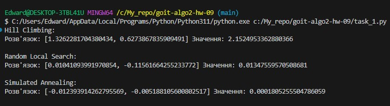

# Домашнє завдання до теми «Локальний пошук, евристики та імітація відпалу»

## Опис виконання

У цьому завданні було реалізовано три різні підходи до локальної оптимізації для мінімізації функції Сфери:

- Hill Climbing  
- Random Local Search  
- Simulated Annealing  

Результати:
